# DeepLab

DeepLab 系列是谷歌团队提出的一系列语义分割算法

+ 2014 DeepLab v1 于2014年推出
+ 2017-2018 DeepLab v2、DeepLab v3、DeepLab v3 +

FCN时期语义分割面临的挑战：

+ 信号下采样问题：连续的池化或下采样操作会导致图像的分辨率大幅度下降，从而损失了原始信息，且在上采样过程中难以恢复。
+ 空间不变性（敏感性）问题：以获取图像中物体为核心的决策，必然需要空间不变性/不敏感，固有地限制了模型的空间精度。换句话说，对于同一张图片进行空间变换（如平移、旋转），其图片分类结果是不变的。但对于图像分割，对一张图片进行空间变换后，其结果是改变的。
+ 多尺度特征问题：将不同尺度的特征图送入网络做融合，对于整个网络性能的提升很大，但是由于图像金字塔的多尺度输入，造成计算时保存了大量的梯度，从而导致对硬件的要求很高。

## DeepLab V1

核心要点：

### 空洞卷积

**空洞卷积**也叫扩张卷积或者膨胀卷积，简单来说就是在卷积核元素之间**加入一些空格(零)来扩大卷积核**的过程。相同kernel size的空洞卷积和标准卷积的**权重shape是一样的**，二者的差异在于空洞卷积改变了输入的采样方法， 标准卷积是连续地、不间隔地采样，而空洞卷积是跳跃式地采样，跳跃的步长就是dilation(r)。当r=1时，空洞卷积和普通卷积一样。当r=2时，如下图所示，空洞卷积的感受野大小为7x7，r=3时，感受野大小为15x15。

### CRF(Conditional Random Field)

输入图像经过多层卷积下采样后会导致分辨率大幅下降，这使得像素的位置信息丢失，导致还原图像尺寸的过程pixel的定位有偏失，体现为pixel-wise的最终预测结果不准确，这最主要表现在物体的边缘位置。为了解决这个问题作者采用了**fully-connected CRF**方法，将网络的输出作为CRF的输入，利用不同位置的像素类别信息关系，通过建立概率图的方式，有效缓解了边缘定位不准确的问题。在DeepLab V3中移除了。

网络结构：

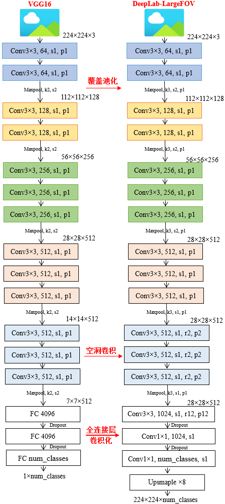

1. 使用**VGG16**作为backbone，和FCN网络一样将全连接层的权重转成了卷积层的权重，构成**全卷积网络**。第一个全连接层的改空洞卷积，通道数为1024，卷积核大小为3×3（FCN中是7×7），dilate rate设为12时（LargeFOV）效果比设为4时好。对于第二个全连接层（FC2）卷积核个数也由4096采样成1024。
2. **Maxpool**略有不同，VGG论文中是`kernel=2，stride=2`，但在DeepLabV1中是`kernel=3，stride=2，padding=1`。
3. **skip subsampling**：将最后两个Maxpool层的stride全部设置成1，不再下采样。并且最后三个3×3卷积采用了**空洞卷积**，系数**`r=2`**。        

在PASCAL VOC2012验证集上，改变第一个全连接层kernel size和空洞卷积rate之后网络的性能和训练速度。

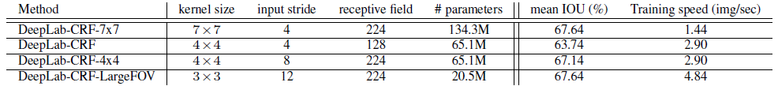

- **DeepLab-CRF-7x7**：直接将FC1按照FCN论文中的方法转换成7x7大小的卷积层，并且膨胀因子r=4（receptive field=224）。
- **DeepLab-CRF**：将7x7下采样到4x4大小的卷积层，同样膨胀因子r=4（receptive field=128），可以看到参数减半，训练速度翻倍，但mean IOU下降了约4个点。
- **DeepLab-CRF-4x4**：在DeepLab-CRF的基础上把膨胀因子r改成了8（receptive field=224），mean IOU又提升了回去了。
- **DeepLab-CRF-LargeFOV**：将7x7下采样到3x3大小的卷积层，膨胀因子r=12（receptive field=224），相比DeepLab-CRF-7x7，**参数减少了6倍，训练速度提升了3倍多，mean IOU不变**。

总结其网络特点：

+ 速度快，论文表述中因为采用了膨胀卷积，而实际上的FC-CRFs非常耗时
+ 准确率更高，相比较之前最好的网络提升了7.2个点
+ 模型结构简单，主要由DCNNs和CRFs联级构成。

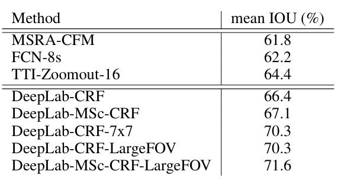

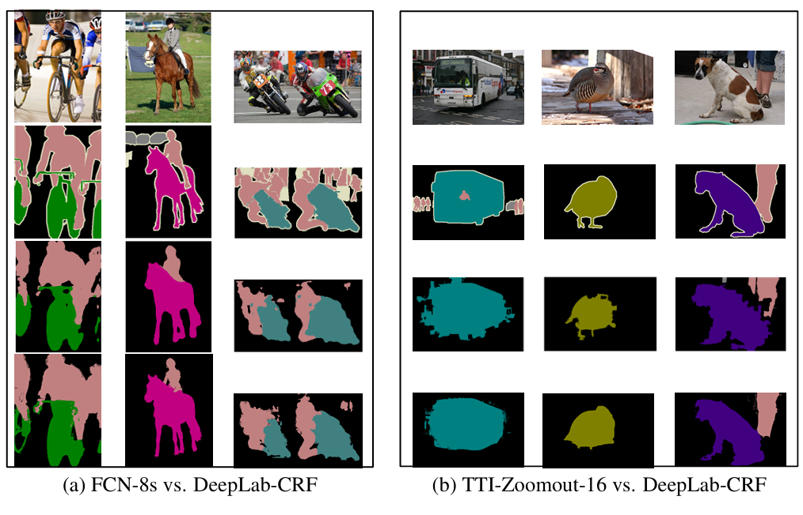

### Msc (Multi-Scale  多尺度（预测）)

论文的 4.3 中还提到了 Multi-Scale Prediction，即融合多个特征层的输出。
$$

$$

将两层的 MLP（第一层：具有 128 个 卷积核且大小为 3 × 3  的卷积，第二层：具有 128 个卷积核且大小为 1 × 1 的卷积）分别附加到输入图像和前四个最大池化层的输出上，然后将它们的特征图与主网络的最后一层特征图进行连接。因此，送入 Softmax 层的聚合特征图将增加 5 × 128 = 640 个通道。

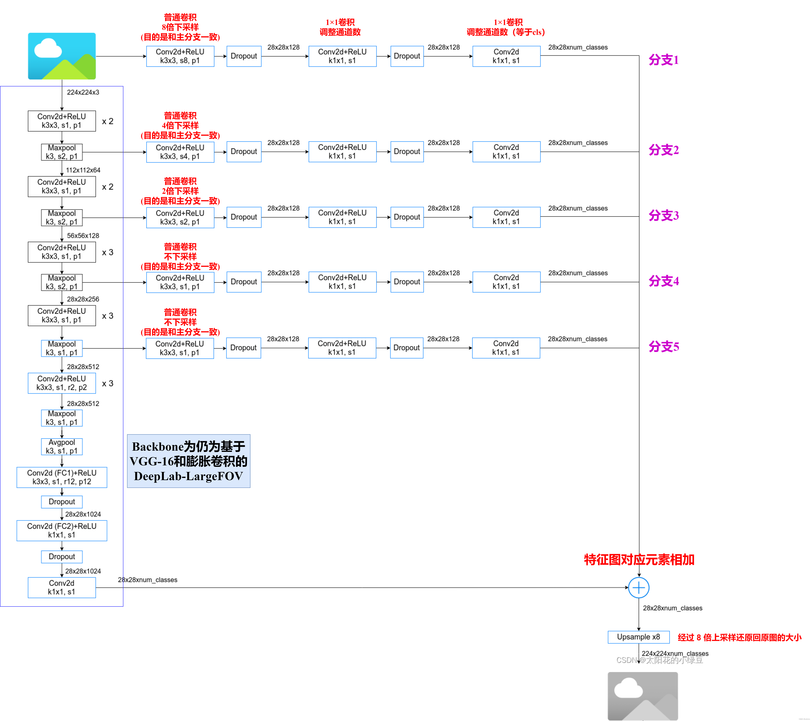

## DeepLab V2

核心要点：

### ASPP（Atrous Spatial Pyramid Pooling）

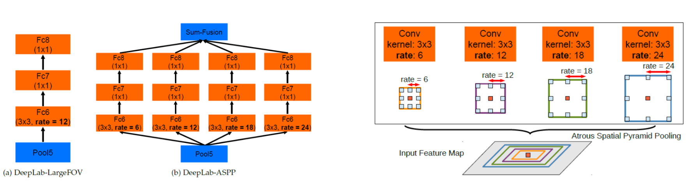

左图为DeepLab-LargeFOV主干网络**VGG16**最后的全连接改卷积的部分，右图将Pool5输出的特征层**并联4个分支**，每个分支分别通过一个3x3的空洞卷积层，1x1的卷积层，1x1的卷积层（卷积核的个数等于`num_classes`）。最后将四个分支的结果进行**Add融合**即可。 如右图 所示，为了对中心像素（橙色）进行分类，ASPP通过使用具有不同rate的多个空洞卷积来获得多尺度特征。不同颜色的框表示中心像素在不同rate下的感受野。如果是以**ResNet101**做为Backbone的话，每个分支只有一个3x3的膨胀卷积层，卷积核的个数等于`num_classes。`

在论文中有给出两个ASPP的配置，**ASPP-S**（四个分支膨胀系数分别为2,4,8,12）和**ASPP-L**（四个分支膨胀系数分别为6,12,18,24），下表是对比LargeFOV、ASPP-S以及ASPP-L的效果。这里只看CRF之前的（before CRF）对比，**ASPP-L优于ASPP-S优于LargeFOV**。

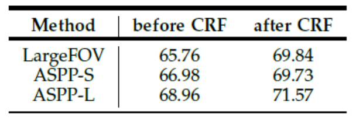

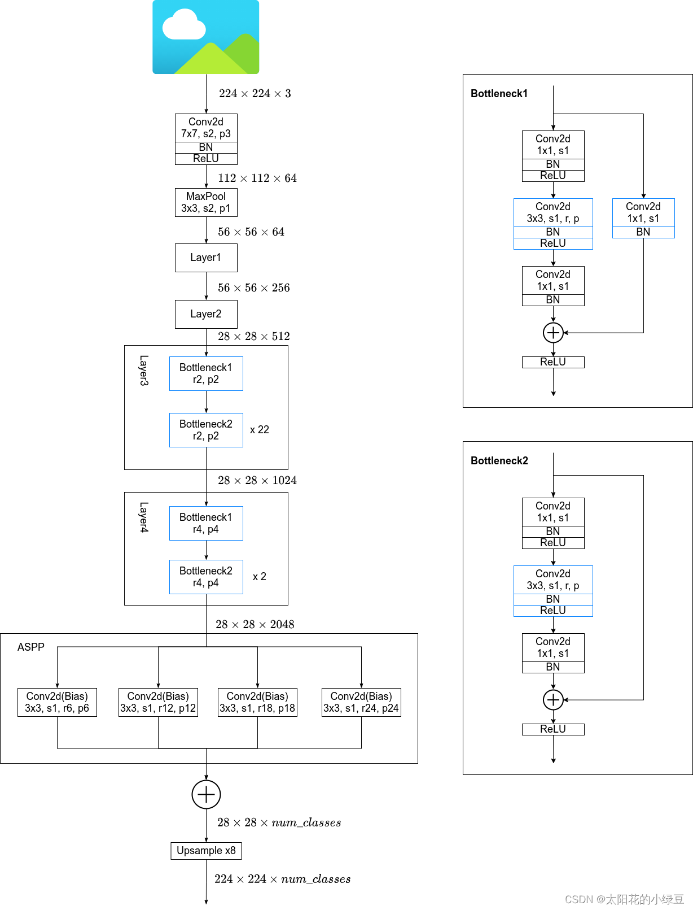

（1）**以ResNet101作为backbone**，将Layer3中的Bottleneck1的3×3卷积（stride=2）的stride设置为1，即**不在进行下采样**，同时3x3卷积层全部**采用空洞卷积**，系数为2。在Layer4中也是一样，取消了下采样，所有的3x3卷积层全部采用空洞卷积，系数为4。

（2）在backbone输出的Feature Map上**并联四个分支**，每个分支的第一层都是使用的空洞卷积，但**不同的分支使用的膨胀系数不同**（即每个分支的感受野不同，从而具有解决目标多尺度的问题）。当以ResNet101为Backbone时，每个分支只有一个3x3的空洞卷积层，卷积核的个数等于`num_classes。`

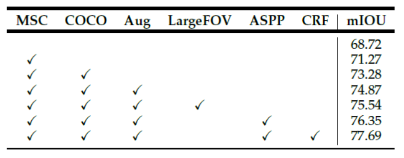

- **MSC**表示多尺度输入，即先将图像缩放到0.5、0.7和1.0三个尺度，然后分别送入网络预测得到score maps，最后融合这三个score maps（对每个位置取三个score maps的最大值）。

- **COCO**就代表在COCO数据集上进行预训练。

- **Aug**代表数据增强，这里就是对输入的图片在0.5到1.5之间随机缩放。

使用ResNet-101取代VGG16作为backbone后，mIOU由65.76%提升到68.72。MSC提升了2.55%，COCO预训练提升了2.01%，数据增强提升了1.6%，LargeFOV（3×3空洞卷积，rate=12）提升了0.6%，池化金字塔提升了0.8%，利用CRF后处理后达到了77.69%。

## DeepLab V3

论文中有给出两个模型，分别是**cascaded model**和**ASPP model**，在cascaded model中是没有使用ASPP模块的，在ASPP model中是没有使用cascaded blocks模块的。作者说ASPP model比cascaded model略好点。包括在Github上开源的一些代码，大部分也是用的ASPP model。

### Cascaded model

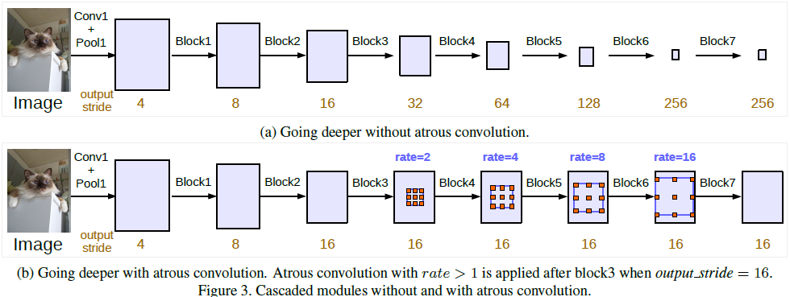

上图中，Block1，Block2，Block3，Block4是原始**ResNet**网络中的层结构，后面又**增加了额外的Block5，Block6，Block7**，结构和Block4一样，即由三个残差结构构成。如图(a)中所示，这么设计的原因是引入的stride使在更深的block中捕获long range information变得容易。比如图(a)中整个图像特征可以总结在最后一个小分辨率特征图中。但是连续的stride削弱细节信息，因此加入空洞卷积，并且根据output_stride调整空洞卷积的rate。图(b)是论文中提出的**cascaded model**，但在Block4中将第一个残差结构里的3x3卷积层以及捷径分支上的1x1卷积层步距stride由2改成了1（即**不再进行下采样**），并且所有残差结构里3x3的普通卷积层都**换成了空洞卷积层**。

从下表可以看出，**随着添加更多的block，模型性能会提高**，但提高的幅度会变小。增加block7使得ResNet-50略微降低了性能，但仍提高了ResNet-101的性能。

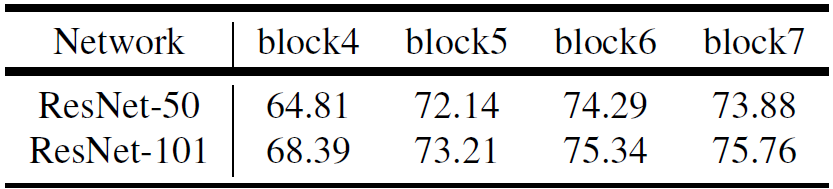

**下表为以ResNet-50为backbone使用7个block时不同output_stride下的mIOU。**当output_stride增大且应用空洞卷积时，mIOU从20.29%提升到75.18%，说明在语义分割中**使用更多block级联时空洞卷积是很有必要的**。

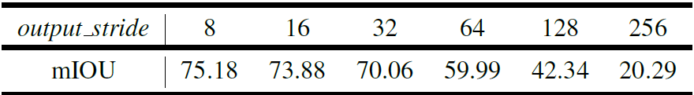

上面blocks中真正采用的膨胀系数应该是**图中的rate乘上这里的Multi-Grid参数**。下表是以cascaded model（ResNet101作为Backbone为例）为实验对象，研究采用不同数量的cascaded blocks模型以及cascaded blocks采用不同的Multi-Grid参数的效果。通过实验发现，**当采用三个额外的Block时（即额外添加Block5，Block6和Block7）将Multi-Grid设置成(1, 2, 1)效果最好。**

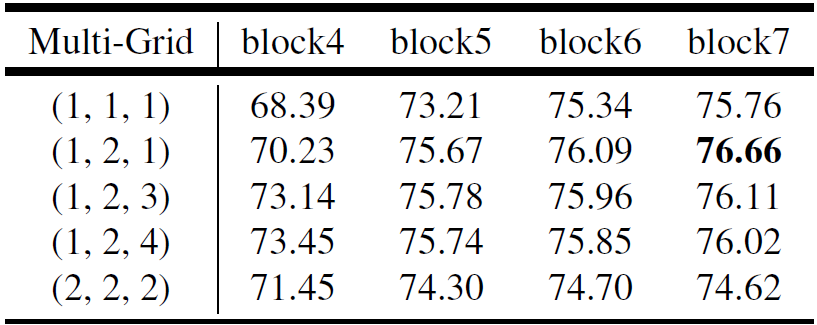

 

### Parallel model（ASPP)

虽然论文大篇幅的内容都在讲cascaded model以及对应的实验，但实际使用的最多的还是ASPP model，ASPP model结构如下图所示：

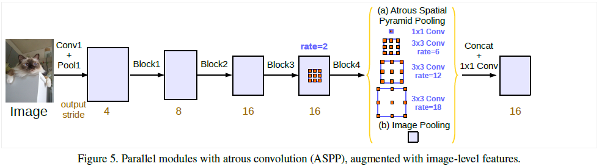

这里的ASPP结构有5个并行分支，分别是一个**1x1的卷积层**，三个**3x3的膨胀卷积层**，以及一个**全局平均池化层**（后面还跟有一个1x1的卷积层，然后通过双线性插值的方法还原回输入的W和H）。然后通过**Concat**的方式将这5个分支的输出进行拼接（沿着channels方向），最后在通过一个**1x1的卷积层进一步融合信息**。

在并行分支加入**image-level feature**是因为作者为了解决空洞卷积带来的一个问题：

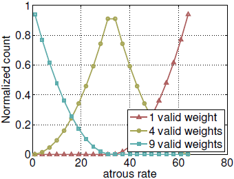

**随着空洞卷积的rate增大，卷积核有效参数越来越少**。比如标准卷积conv3×3，rate=1，只有在feature map最外面一圈会有卷积核参数超出边界而无效，当rate变大，越来越多外圈的位置是有卷积核参数失效的，用极限思想思考一下，如果rate=size(feature map)，那么每次卷积都是卷核中心对应的feature map像素点被计算了，卷积核参数也只有中心那个点没有失效，**退化成了1×1卷积核**。

**为了解决这一问题，并且包含全局上下文信息，作者在并联结构中加入****image-level feature**。做法是先对输入的feature map全局平均池化（global average pooling），后接256通道的1×1卷积层，BN层，最后用户双线性插值的方法上采样到目标大小，即与ASPP输出的feature map尺寸相同。

下表是ASPP模型在output_stride=16的情况下，multi-grid和image-level features的效果。首先，在三个3×3卷积的并行分支中采用**rate=(6,12,18)**，然后block4中使用三种不同的multi-grid，可以看出**multi-grid=****(1,2,4)**效果最好。**多加一个并行分支rate=24会使得mIOU下降0.12%，使用image-level features可以提升0.63%**。

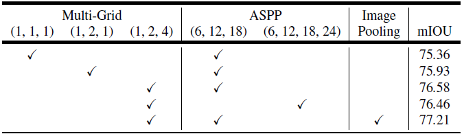

### 两个模型比

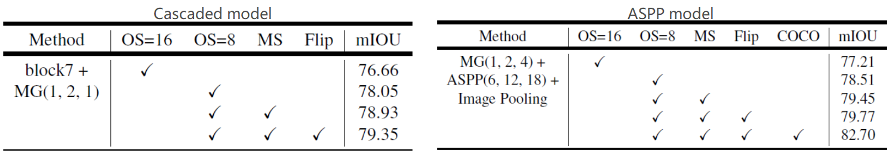

- **MG**代表Multi-Grid，刚刚在上面也有说在ASPP model中采用MG(1, 2, 4)是最好的。
- **ASPP**三个3×3的空洞卷积rate分别为6，12，18
- **Image Pooling**代表在ASPP中加入全局平均池化层分支。
- **OS**代表output_stride，在训练时将output_stride设置成16，验证时将output_stride设置成8效果会更好。
- **MS**代表多尺度，和DeepLabV2中类似。不过在DeepLab V3中采用的尺度更多scales = {0.5, 0.75, 1.0, 1.25, 1.5, 1.75}。
- **Flip**代表增加一个水平翻转后的图像输入。
- **COCO**代表在COCO数据集上进行预训练。挑选COCO数据集中有VOC定义的类别的图，将VOC中不包含的类别当作背景类。

**ASPP模型的效果（79.77%）好于Cascaded模型（79.35%），所以deeplab v3一般也是指ASPP的结构。**

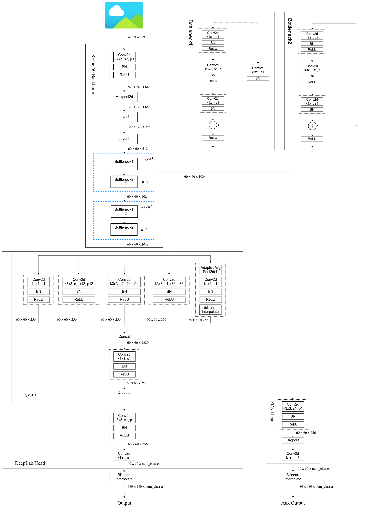

## DeepLab V3+

**空间金字塔池化**模块网络能够通过不同空洞率的、具有不同感受野的空洞卷积或池化操作，编码多尺度上下文信息，而**编码器-解码器**结构可以通过逐步恢复空间信息来捕获更清晰的目标边界。deeplab v3+结合了这两种方法的优点。添加了解码器模块细化分割结果，特别是沿着对象边界。同时进一步探索了**Xception**模型，并将**深度可分离卷积**应用于空间空间金字塔池化和解码器模块，从而得到一个更快更强的编解码器网络。

### **空洞可分离卷积（atrous seperable convolution）**

 

上图中（a）是**深度卷积**，单独的为每个channel进行卷积操作；（b）是**点卷积**用来融合channel间的信息。（a）和（b）就组成了[**深度可分离卷积**](https://www.cnblogs.com/Fish0403/p/15783564.html)。那如果将（a）中的标准卷积操作替换为**空洞卷积**，如图（c）所示就实现了带有空洞卷积的深度可分离卷积，论文称之为**空洞可分离卷积**（atrous seperable convolution）。论文应用空洞可分离卷积极大的减少所提出模型的计算复杂度与此同时维持了与原模型相似或者更好的模型效果。

### Encoder

将Deeplab v3作为编码器模块，输出特征图包含256个通道数。DeepLab v3+以**Xception**作为骨干网络，并对其进行了微调(如下图所示）：

- 更深的Xception结构，原始middle flow迭代8次，微调后迭代**16**次
- 所有max pooling结构被stride=2的**深度可分离卷积**替代
- 每个3x3的depthwise convolution后都跟**BN**和**Relu** 

### Decoder

**DeepLabv3直接将特征上采样16倍，无法成功地恢复目标分割的细节**。因此，作者提出了一个简单而有效的解码器模块，如下图红色框内。编码器特征首先提前上采样4倍，然后与网络主干中具有相同空间分辨率的相应低级特征连接。同时应用一个1×1的卷积调整通道数（256个），在连接之后，应用几个3×3卷积来细化特征，然后使用双线性插值，将特征上采样4倍。

**评估decoder中1×1卷积的作用**

使用resnet-101，Conv2的特征图和256个3×3卷积，分别将low level features减少到8，16，32，48，64通道数，其中**48通道效果更好**。

**设计3×3卷积结构**

concat特征图之后，利用**2个256通道的3×3卷积**效果比用1个和3个要好，减少通道数或者减小kernel size都会使得效果变差。下面的Conv3是指，将特征图上采样两倍和Conv3特征图concat，再与Conv2特征图concat。

### 效果

当使用Xception作为DeepLabv3+的backbone时，为了比较精度和速度的变化，观察了mIOU以及Multiply-Adds。得益于空洞卷积，模型在训练时能够在不同分辨率下获取特征以及在模型验证时使用单一模型。

- **OS**代表output_stride，在训练时将output_stride设置成16，验证时将output_stride设置成8效果会更好。
- **Decoder**表示是否使用本文提出的decoder模块
- **MS**代表多尺度，和DeepLabV2中类似。不过在DeepLab V3中采用的尺度更多scales = {0.5, 0.75, 1.0, 1.25, 1.5, 1.75}。
- **Flip**代表增加一个水平翻转后的图像输入。
- **SC**表示是否采用深度可分离卷积在ASPP以及decoder模块中
- **COCO**代表在COCO数据集上进行预训练。挑选COCO数据集中有VOC定义的类别的图，将VOC中不包含的类别当作背景类。
- **JFT**表示模型是否在JFT上预训练

以resnet-101为骨干网络时mIOU为**80.57%**，相同策略下以Xception为骨干网络时为**81.63%**，Decoder提升了**0.29%**。

