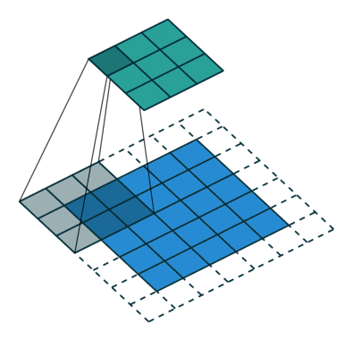
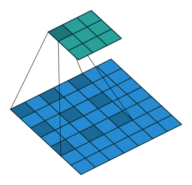
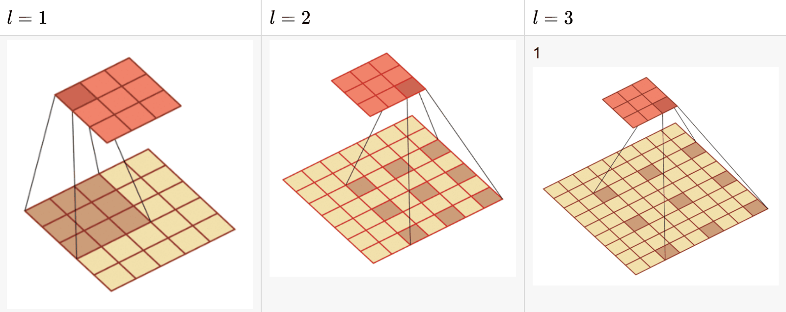
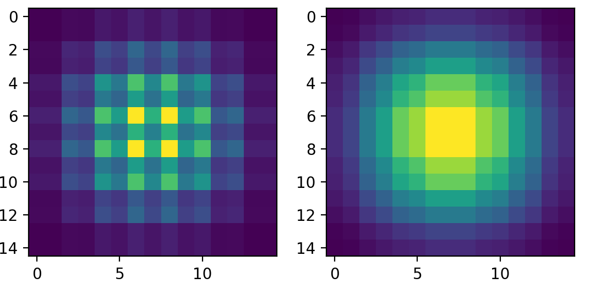

# 膨胀卷积（空洞卷积）（Dilated convolution）

## 概述

- 空洞卷积自2016在ICLR(International Conference on Learning Representation)上被提出的。
- 空洞卷积中文名也叫**「膨胀卷积」**或者**扩张卷积**,英文名也叫**「Atrous Convolution」**
- 空洞卷积可以在**「增加感受野」**的同时**「保持特征图的尺寸不变」**,从而代替下采样和上采样操作。

## 原理

### 1.增加感受野

正常情况下的转置卷积（上采样）
$$
k = 1,p=1,s=2,r=1
$$

空洞卷积（上采样）
$$
k=3,p=0,s=1,r=2
$$

实际上标准卷积是空洞卷积的一种`特殊形式`

$$
我们认为空洞卷积核K^`与标准卷积核K之间应该满足如下公式：\\
K^` = K + (K - 1)(R - 1) \\

其中R为扩展率
$$
实际上nn.Conv2d中已经内置了`dilation`参数作为扩展率的选项。
$$
如果标准卷积中感受野的公式为：\\
r_n = r_{n-1} + (k - 1) \sum_{i=1}^{n-1}s_i \\
r_n:本层感受野 \\
r_{n-1}:前一层的感受野 \\
s_i:第i层卷积或池化层的步长 \\
k:标准卷积大小
$$
而将上述公式切换为`空洞卷积核`
$$
如果标准卷积中感受野的公式为：\\
r_n = r_{n-1} + (k^` - 1) \sum_{i=1}^{n-1}s_i \\
r_n:本层感受野 \\
r_{n-1}:前一层的感受野 \\
s_i:第i层卷积或池化层的步长 \\
k^`:标准卷积大小
$$

### 2.保持特征图的尺寸不变

标准卷积的特征图尺寸公式
$$
n_{out} = \frac{n_{in} + 2p - f}{s} + 1 \\
n_{out}: 输出特征尺寸\\
n_{in}: 输入特征尺寸\\
p: 池化\\
f: 卷积核\\
s: 步长\\
$$
若是正常的下采样，则标准卷积和空洞卷积之间唯独只有扩张率不同，对于下采样特征图没有任何影响。

### 3.gridding effect

当我们使用多层空洞卷积时，会出现gridding effect问题

如果我们设置的是3层3x3卷积，扩张率分别是（2，2，2）以及（1，2，3）

左侧情况便是gridding effect主要是不连续，且呈现网格状。

右侧则是在感受野中的所有元素都被使用，呈连续状态

那么如何设置多个空洞卷积的扩张率很关键，在论文[《Understanding Convolution for Semantic Segmention》](https://arxiv.org/abs/1702.08502)中便有设置规则。

## 空洞卷积规则

### 规则一：第二层的两个非零元素之间的最大距离小于等于该层卷积核的大小

$$
上述规则需要满足：最终需要满足 M_2 < K \\
M_i = \max[M_{i+1} - 2r_i,M_{i+1} - 2(M_{i+1} - r_i),r_i] \\
M_i:第i层两个非零元之间的最大距离 \\
r_i:第i层的扩张系数 \\
$$

这里我们可以尝试计算 （1，2，5）与（1，2，9）

### 规则二：扩张系数从1开始设置

### 规则三：扩张系数的公约数不能大于1

比如（2，4，8）不可以

### 建议：将扩张系数设置为锯齿状

论文原文翻译：**通过这样做，顶层可以从更广泛的像素范围内访问信息，他们位于与原始配置相同的区域内。这个过程在所有的层中都重复进行，从而使顶层的感受野保持不变。**

比如（1，2，3，1，2，3）
