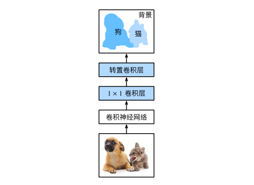
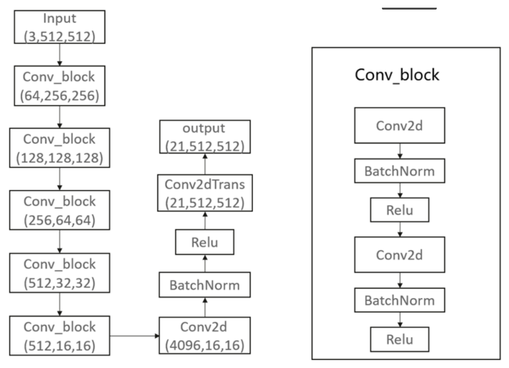
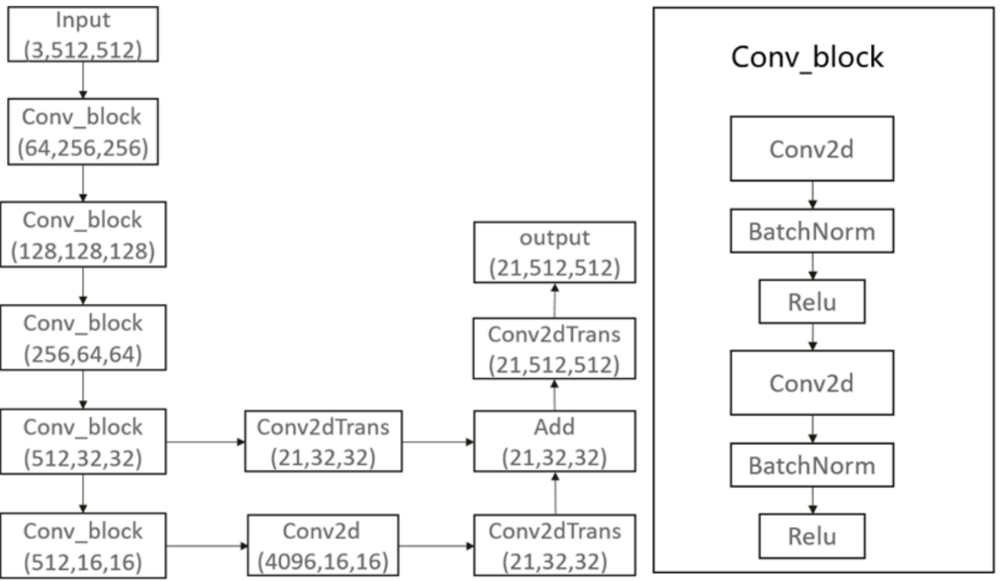
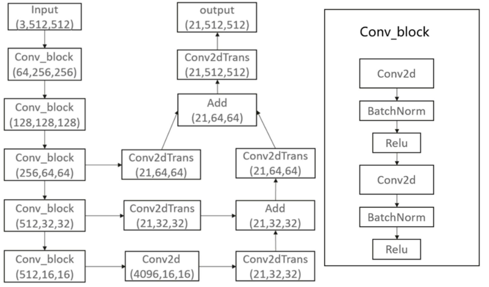

# FCN

> 语义分割是对图像中的每个像素分类。全卷积网络（fully convolutional network，FCN）采用卷积神经网络实现了从图像像素到像素类别的变换。

与图像分类与目标检测部分的卷积网络不同，全卷积网络将中间层特征图的高和宽变回输入图像的尺寸，而这是转置卷积（transposed convolution）的重要作用，在输出的类别预测与输入图像在像素级别上具有一一对应关系：通道维的输出即该位置对应像素的类别预测。

[TOC]

## 1.FCN模型结构实现

全卷积网络先使用卷积神经网络抽取图像特征，然后通过1x1卷积层将通道数变换为类别个数，最后通过转置卷积层将特征图的高和宽变换为输入图像的尺寸。模型输出与输入图像的高和宽相同，且最终输出通道包含了该空间位置像素的类别预测。

FCN模型结构可以根据分割细粒度使用FCN32s、FCN16s、FCN8s等结构，32s即从32倍下采样的特征图至输入大小，16s和8s则是16倍和8倍下采样恢复至输入大小，当然还可以使用4s、2s结构，数字越小使用的反卷积进行上采样越多，对应模型结构更加复杂，理论上分割的效果更精细。

FCN32s结构：

FCN16s结构：

FCN8s结构

