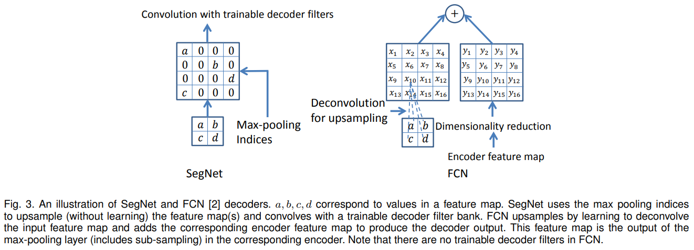
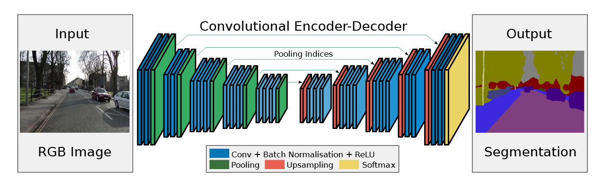
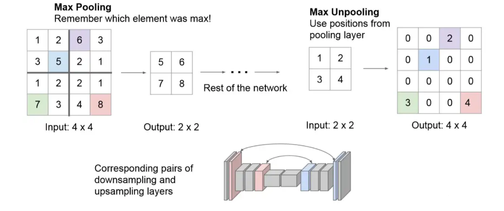

# SegNet

>SegNet是2016年cvpr由Cambridge提出旨在解决自动驾驶或者智能机器人的图像语义分割深度网络，开放源码，基于caffe框架。SegNet基于FCN，修改VGG-16网络得到的语义分割网络，有两种版本的SegNet，分别为SegNet与Bayesian SegNet，同时SegNet作者根据网络的深度提供了一个basic版（浅网络）。

## SegNet与Unet

SegNet核心由一个编码器网络和一个对应的解码器网络以及一个像素级分类层组成。

## SegNet的创新

解码器使用在对应编码器的`最大池化`步骤中计算的池化索引来执行线性上采样，这与反卷积相比，减少了参数量和运算量，而且消除了学习`上采样`的需要。

## SegNet的网络结构

### Encoder

1、Conv层

- 通过卷积提取特征，其中使用的是`same padding`的卷积，不会改变特征图的尺寸
- BN层
- 起到归一化的作用
- ReLU层
- 起到激活函数的作用
- Pooling层
- `max pooling`层，同时会**记录最大值的索引位置**

### Decoder

1、Upsamping 层

