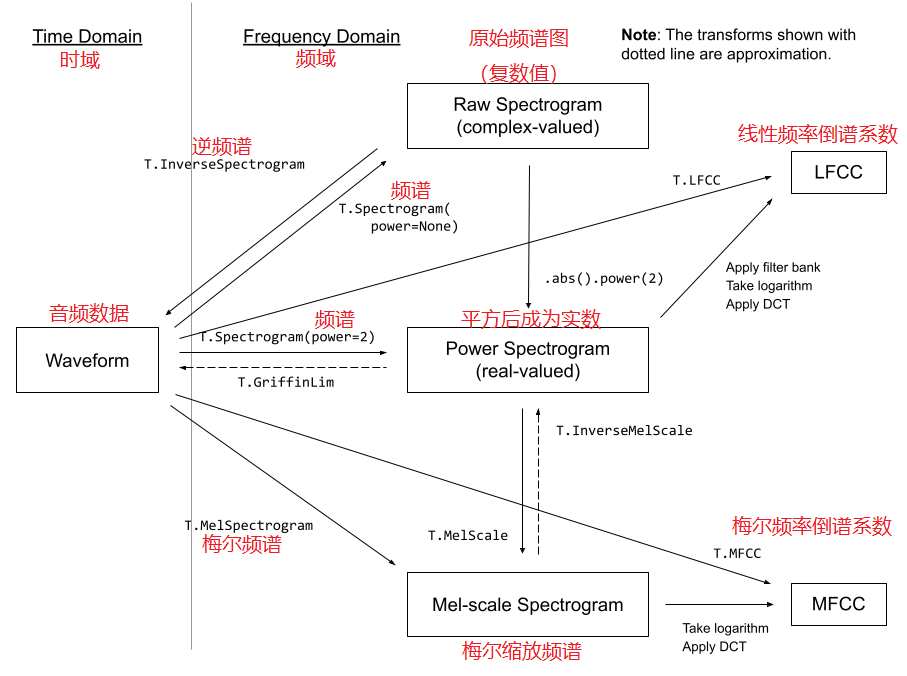
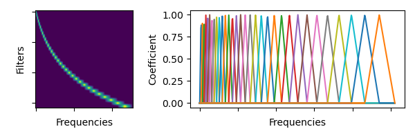

# 官方音频特征提取教程

官网地址: https://pytorch.org/audio/stable/tutorials/audio_feature_extractions_tutorial.html#sphx-glr-tutorials-audio-feature-extractions-tutorial-py

## 示意图

## 短时傅里叶频谱变换

API [torchaudio.transforms.Spectrogram](https://pytorch.org/audio/stable/generated/torchaudio.transforms.Spectrogram.html?highlight=transforms+spectrogram#torchaudio.transforms.Spectrogram)，将音频信号进行短时傅里叶变换，输出为频谱图

重要参数:

- n_fft: 傅里叶变换窗口，傅里叶变换后将得到 `n_fft // 2 + 1` 个特征点 (默认 center 参数为 True，傅里叶变换时会自动进行填充操作)
- hop_length: 窗口移动步幅
- power: 傅里叶变换后的频谱指数

重点: 

- 提取音频的频域特征
- 完整保留了所有频率段的特征

## 梅尔频谱变换

API [torchaudio.transforms.MelSpectrogram](https://pytorch.org/audio/stable/generated/torchaudio.transforms.MelSpectrogram.html?highlight=t+melspectrogram#torchaudio.transforms.MelSpectrogram)

梅尔频谱变换是集成了傅里叶变换和梅尔滤波器组的转换器

重要参数 (部分参数和 torchaudio.transforms.Spectrogram 相同)

n_mels: 创建多少组梅尔滤波器

梅尔滤波器是三角形的，并且会根据最高频率，最低频率，还有 n_mels 自动创建若干个滤波器，如图:

重点:

- 模拟人类耳朵能够识别的频率范围，取提取音频中的特征
- 会丢失一部分频率的数据

## 总结

- torchaudio.transforms.Spectrogram 和 torchaudio.transforms.MelSpectrogram 都是用于提取音频特征的工具
- torchaudio.transforms.MelSpectrogram 提取的音频特征更接近人耳能听到的范围
- torchaudio.transforms.Spectrogram 和 torchaudio.transforms.MelSpectrogram 相当于卷积可以提取图像特征，它们用于提取音频特征